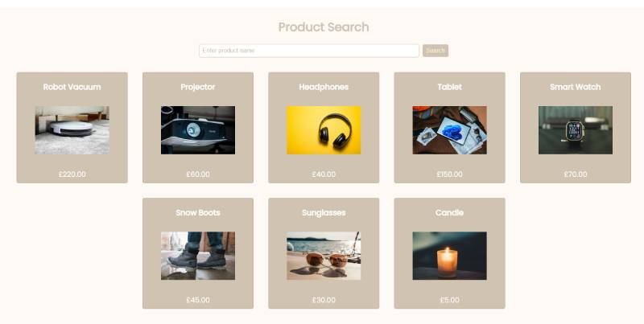

# Product Search Page

A clean and responsive web page that allows users to search for products and view their images and prices. Designed with usability and interactivity in mind.

## Features

* Search bar to type product names
* Search button to display matching products
* Product cards with images, names, and prices
* Responsive layout for desktop and mobile
* Button hover effects and animated product cards for a polished UI

## How it Works

1. Type the name of the product in the search bar
2. Click the **Search** button
3. Matching products are displayed below in animated cards

## Built With

* HTML
* CSS
* JavaScript

## Future Improvements

* Handle empty search results with a user-friendly message
* Add filters or sorting (by price or category)
* Display detailed product information in a modal on card click
* Integrate a product API for dynamic data
* Enhance UI with additional animations or transitions

## Usage

View Project on GitHub by clicking the copying the below link into your browser:
https://juliep0317.github.io/product-search/

## Screenshot

## Author

Julie Palmer – Frontend Developer | Graphic Designer
